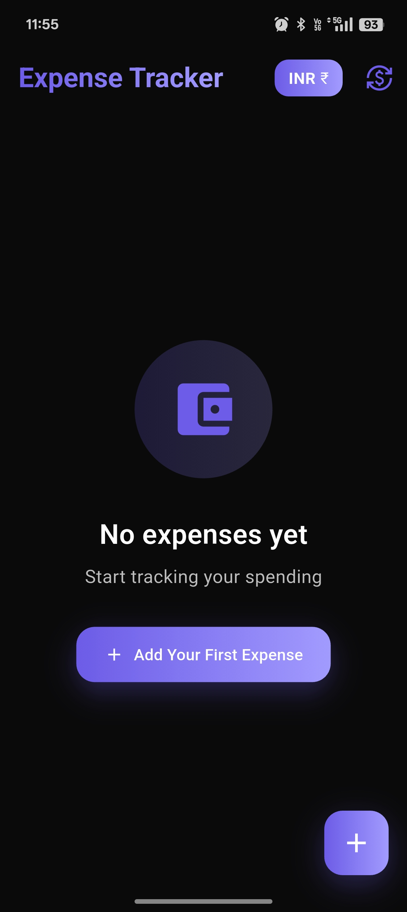
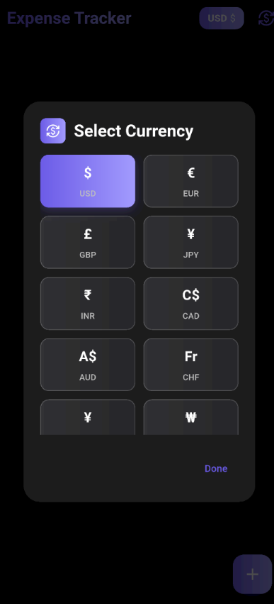
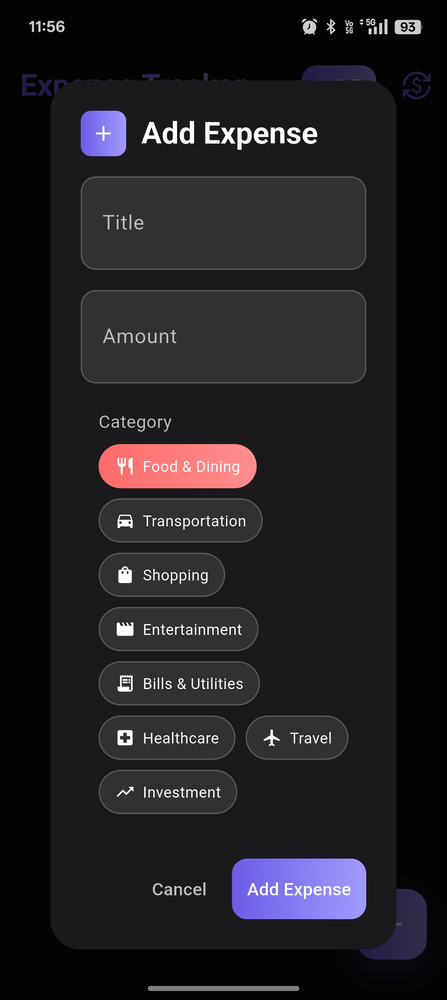
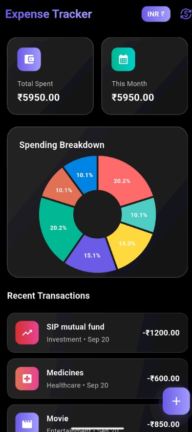

## Expense Tracker

A modern Flutter expense tracking app with dark UI and interactive charts.

## Screenshots

   

## Features

- Add and track expenses with categories
- Interactive pie chart for spending breakdown
- Multi-currency support (USD, EUR, GBP, JPY, INR, etc.)
- Swipe to delete expenses
- Monthly and total spending overview
- Dark theme with glassmorphism design

## Categories

Food & Dining • Transportation • Shopping • Entertainment • Bills & Utilities • Healthcare • Travel • Investment

## Tech Stack

- **Flutter** - UI framework
- **fl_chart** - Interactive charts
- **intl** - Date formatting

## Setup

```bash
git clone https://github.com/adeshpatel700-rgb/expense-tracker.git
cd expense-tracker
flutter pub get
flutter run
```

## Build

```bash
flutter build apk --release
```
